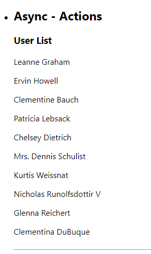

# Hi Friends Welcome to the series of Redux using React UI !!!!!


###  For better understanding on Redux feature, How it works? I recommend you guys go throgth my [Redux-JavaScript](https://github.com/PrasanthReddy-Chittapu6683/Redux-JavaScript/blob/master/README.md) repositry  for better understanding and come back here

__`Lets start with Redux using React UI`__


*   __`Let see the steps how Redux work with React UI application`__
        
*   Lets go and start creating the same steps using some React UI elements.

*   Create react application using below command lines :
    *   `npx create-react-app redux-reactui-demo`
    *   `npm install --save redux react-redux`


### `Actions`

*   Here will define `Actions & Action Creators`
*   Lets create new folder `Redux -> cake` under `src` folder

*   Create a file `cakaeTypes.js`:
    ``` javascript
        export const BUY_CAKE = 'BUY_CAKE'
    ```
*   Create a file `cakaeAction.js`:
    ``` javascript
        const { BUY_CAKE } = require("./cakeTypes")
        import { BUY_CAKE } from './cakeTypes'

        export const buyCake = () => {
            return {
                type: BUY_CAKE
            }
        }
    ```
*   We are done creating the Actions and lets create `Reducer`

### `Reducers`

*   Create a file `cakaeReducer.js`:
    ```javascript
        import { BUY_CAKE } from './cakeTypes'

        const initialState = {
            numOfCakes: 10
        }

        const cakeReducer = (state = initialState, action) => {
            switch (action.type) {
                case BUY_CAKE:
                    return {
                        ...state,
                        numOfCakes: state.numOfCakes - 1
                    }
                default:
                    return state
            }
        }
        export default cakeReducer
    ```
*   We are done creating the Reducer function and exported and now lets create `Store`

### `Store`

*   Create a file `store.js`:

    ``` javascript
        import { createStore } from 'redux'
        import cakeReducer from './cakeReducer'

        const store = createStore(cakeReducer)

        export default store
    ```
*   We are done creating the Redux store by importing cakeReducer function to createStore library function.
*   Now we need to provide this Redux store to React application. Lets see how !!

*   Goto `App.js` file and import the Provider component from  `react-redux` library & `store` from `Redux` folder
*   Just wrap the `Provider` component  in our App.js file jsx function as shown below:
*   Pass the `store` as a `props` to the Provide component
    ``` javascript
        import React from 'react';
        import './App.css';
        import CakeContainer from './components/CakeContainer';
        import { Provider } from 'react-redux';
        import store from './Redux/store'
        function App() {
        return (
            <Provider store={store}>
            <div className="App">
                <h1 style={{ textAlign: 'center' }}>
                Redux in React UI
            </h1>
                <ul>
                <li>
                    <h2>React UI:</h2>
                    <CakeContainer></CakeContainer>

                </li>
                </ul>
            </div>
            </Provider>
        );
        }

        export default App;

    ```
*   We are done creating the Redux store and provding it to React application. Now lets understand how our component `dispatch` the action and `subscribe`  the change in the `store`
    *   

*   Lets go step by step 

*   __`Step 1 :`__
    *   In CakeContainer.js component create a function called `mapStateToProps`
    *   When you want to access the Redux state in your component you define `mapStateToProps` function. It gets Redux state as a prarmeter which can be used to retrieve the appropriate state properties 
    *   Here we use `state.numOfCakes` to a props `numOfCakes` which we render in  JSX `{props.numOfCakes}`
        ``` javascript
            const mapStateToProps = (state) => {
                return {
                    numOfCakes: state.numOfCakes
                }
            }
        ```

*   __`Step 2 :`__
    *   Now we need to dispatch the Actions we create a function called `mapDispatchToProps`
    *   `mapDispatchToProps` function gets `dispatch` method as a parameter and allows us to map a Action Creators `dispatch(buyCake())` to our porps `buyCake` in our component which we render in JSX click event `onClick={props.buyCake}`
        ``` javascript
            const mapDispatchToProps = dispatch => {
                return {
                    buyCake: () => dispatch(buyCake())

                }
            }
        ```

*   __`Step 3 :`__
    *   Above __`Step 1 :`__ & __`Step 2 :`__ will connect to our commonent using `connect()` function from `react-redux` library
         ``` javascript
            export default connect(
                mapStateToProps,
                mapDispatchToProps)  (CakeContainer)
         ```
    *   This `connect()` function will connect this `CakeContainer` component to  Redux store `store`

*   OutPut: 

__`This is the basic pattern of React with Redux. If you get confuse, please go back to top and read the above steps carefully one more time.`__


### `React Redux with Hooks`

*   Till now saw React Redux pattern.
*   Action creators, reducers, procide the store and connect the component.
*   Components can access state and dispatch actions.
*   Now React Hooks got introduced in Redux store (v7.1)
    *   React Hooks gives functional components ability's to use local components state, execute side effects and so on ....
    *   To Know about React Hooks completely [Goto my repository](https://github.com/PrasanthReddy-Chittapu6683/React-HOOKS/blob/master/README.md)
*   Using the React Hooks in Redux it offers a set of HOOK API's as an alternative to existing connect `Higher Order Component(HOC)`
*   This API's allows us to `subscribe` the `Redux store` and `dispatch` actions without wrapping our component with `connect()` function

__`Lets see How to use Hooks in Redux`__

### `useSelector Hook`

*   `useSelector` Hook acts as an equalent to `mapStateToProps` function which defined earlier.
*   To get hold of any state in the Redux store we use `useSelector` Hook
    *   In our examplewe need to store `num of cakes` in the Redux store.

*   __`Step 1 :`__
    *   Import `useSelector` and use  `useSelector` function to hold `numOfCakes`
    `` javascript
        import { useSelector } from 'react-redux'
        const numOfCakes = useSelector(state => state.numOfCakes)
    ```
*   __`Step 2 :`__
    *   Add `numOfCakes` in JSX

*   OutPut:

### `useDispatch Hook`

*   It is used to dispatch an action using react Hook.

*   __`Step 1 :`__
    *   Import `useDispatch` from `react-redux`
    *   Import `buyCake` function from `Redux`(cakeAction.js)
*   __`Step 2 :`__
    *   Declare   useDispatch() Hook and add the button click event
    ``` javascript
        const dispatch = useDispatch()  
        <button onClick={() => dispatch(buyCake())}>Buy Cake</button>
    ```
*   OutPut:
*   _`Refer:`__ HooksCakeContainer.js

#### Now lets start new Action to buy ICEREAM & Burger

*   __`Step 1 :`__
    *   Create folder `iceCream & burger` inside `Redux` folder
    *   Create same set file in both folders:
        *   iceCream:
            *   iceCreamAction.js
            *   iceCreamReducer.js
            *   iceCreamType.js
        *   burger:
            *   burgerAction.js
            *   burgerReducer.js
            *   burgerType.js
*   __`Step 2 :`__
    *   Now create new file `rootReducer.js` under `Redux` folders
        *   This file is used to merge multiple Reducers which we will add it for createStore function.
        *   Import all reducer functions and export `rootReducer`
            ``` javascript
                import { combineReducers } from 'redux'
                import cakeReducer from './cake/cakeReducer'
                import iceCreamReducer from './iceCream/iceCreamReducer'
                import burgerReducer from './burgger/burgerReducer'
                const rootReducer = combineReducers({
                    cake: cakeReducer,
                    iceCream: iceCreamReducer,
                    burger: burgerReducer
                })

                export default rootReducer

            ```
    *   Now edit store.js file as below by importing `rootReducer` and passing to createStore which can now accepts multiple Reducer functions
         ``` javascript
            import { createStore } from 'redux'
            import rootReducer from './rootReducer'

            const store = createStore(rootReducer)
            export default store
        ```
*   __`Step 3 :`__  
    *   Goto `components` folder create files for `iceCreamContainer.js, HookIceCreamContianer.js &  burgerContainer.js, HooksBurgerContianer.js`
        ```javascript
            iceCreamContainer.js:
                import React from 'react'
                import { buyIceCream } from '../Redux'
                import { connect } from 'react-redux'

                function IceCreamContainer(props) {
                    return (
                        <div>
                            <h2>No of IceCreams : {props.numOfIceCremas}</h2>
                            <button onClick={props.buyIceCream}> Click on Buy IceCremas</button>
                        </div>
                    )
                }

                const mapStateToProps = (state) => {
                    return {
                        numOfIceCremas: state.iceCream.numOfIceCremas
                    }
                }

                const mapDispatchToProps = dispatch => {
                    return {
                        buyIceCream: () => dispatch(buyIceCream())
                    }
                }

                export default connect(
                    mapStateToProps,
                    mapDispatchToProps)(IceCreamContainer)
        ``` 
        ``` javascript
        HookIceCreamContianer.js
            import React from 'react'
            import { useSelector, useDispatch } from 'react-redux'
            import { buyIceCream } from '../Redux'
            function HookIceCreamContainer() {

                const numOfIceCremas = useSelector(state => state.iceCream.numOfIceCremas)
                const myDispatch = useDispatch()
                return (
                    <div>
                        <h2>No of IceCreams : {numOfIceCremas}</h2>
                        <button onClick={() => myDispatch(buyIceCream())}> Click on Buy IceCremas using Hooks</button>
                    </div>
                )
            }
            export default HookIceCreamContainer
        ```

### `Logger Middleware`

*   __`Step 1` :`__  
    *   Goto termaial and install `npm i redux-logger`
*   __`Step 2 `:__  
    *   Import `logger` in `store.js` file.
    *   `import logger from 'redux-logger'`
*   __`Step 3 `:__
    *   Import `applyMiddleware` from `redux`
    *   Pass this `applyMiddleware` as a 2nd argument which take input parameter `logger`
*   ``` javascript
    store.js
        import { createStore, applyMiddleware } from 'redux'
        import rootReducer from './rootReducer'
        import logger from 'redux-logger'
        const store = createStore(rootReducer, applyMiddleware(logger))
        export default store
    ```
*   Now Goto consle and take action. It will print the log information how the state values is changing.
    

### `Redux Devtool Extension`

*   THis is the more helpful tool that works on browsers
*   Goto Chrome store and seach with `React Developer Tools`
*   Now install the below command to enable to `React developer Tools` in your browser.
    *   `npm install --save redux-devtools-extension`
*   Import in store.js
    *   `import { composeWithDevTools } from 'redux-devtools-extension';`
*   Run our application will see the extension icon is enabled or goto Inspect elements will see the tab `Redux`
    
    
*   Here you can explore by clicking on the buttons how th state, Action value is changing and which function is calling,.etc,.
    


### `Action payload`

*   Using this Action payload i have added textbox reset button functinality: Refer the code in `NewCakeContainer.js`
    ``` javascript
        import React, { useState } from 'react'
        import { connect } from 'react-redux'
        import { buyCake, resetCake } from '../Redux'

        function NewCakeContainer(props) {
            const [NumberCnt, setNumberCnt] = useState(1)
            const resetClick = 10
            const resetClickFun = () => {
                setNumberCnt(1)
                props.resetCake(resetClick)
            }
            const buyCakeFun = () => {
                if (NumberCnt > 10) {
                    alert('No Stock')
                    setNumberCnt(1)
                    props.resetCake(resetClick)
                } else {
                    props.buyCake(NumberCnt)
                }
            }
            return (
                <div>
                    <h2>Num Of Cakes: {props.numOfCakes}</h2>
                    <input type='text' value={NumberCnt} onChange={e => setNumberCnt(e.target.value)}></input>
                    <button onClick={buyCakeFun}>Buy {NumberCnt} Cake</button>
                    <button onClick={resetClickFun}>Reset</button>
                </div>
            )
        }
        const mapStateToProps = (state) => {
            return {
                numOfCakes: state.cake.numOfCakes
            }
        }
        const mapDispatchToProps = (dispatch, ownProps) => {
            return {
                buyCake: (NumberCnt) => dispatch(buyCake(NumberCnt)),
                resetCake: (resetnum) => dispatch(resetCake(resetnum))
            }
        }
        export default connect(mapStateToProps, mapDispatchToProps)(NewCakeContainer)

    ```


 
### `mapDispatchToProps`

*   In  `mapDispatchToProps` is a function wich accepts 2 parameters `dispatch` & `ownProps`. Refer the code in `ItemContainer.js`
    *   ``` javascript
            import React from 'react'
            import { connect } from 'react-redux'
            import { buyCake, buyIceCream } from '../Redux'
            function ItemContainer(props) {
                return (
                    <div>
                        <h2>Item - {props.item}</h2>
                        <button onClick={props.buyItem}>Buy Items - ({props.Name})</button>
                    </div>
                )
            }
            const mapStateToProps = (state, ownProps) => {
                const itemState = ownProps.cake ? state.cake.numOfCakes : state.iceCream.numOfIceCremas
                const itemName = ownProps.cake ? 'Cake' : 'Ice Cream'
                return {
                    item: itemState,
                    Name: itemName
                }
            }

            const mapDispatchToProps = (dispatch, ownProps) => {
                const dispatchFunc = ownProps.cake ? () => dispatch(buyCake()) : () => dispatch(buyIceCream())
                return {
                    buyItem: dispatchFunc
                }
            }

            export default connect(mapStateToProps, mapDispatchToProps)(ItemContainer)

    ```

### `Async Actions`

###### Synchronous Actions:
*   As soon as an action was dispatched, the state was immmediately updated.
*   If you dispatch the BUY_CAKE action, the numOfCakes was right away decremented by 1.
*   Same with BUY_ICREAM & BIY_BURGER aswell.

###### Async Action
*   Asynchronous API calls to fetch data frm an end point and use that data in your application.
*   Lets try 1 example by fetching the data from API end point.
*   Install the axios and thunk using the command in termaial  __`npm install axios redux-thunk`__ 
*   In `Redux` folder create another folder called  `asyncUser` and create below files.
    *   __`userType.js`__
        ``` javascript
            export const FETCH_USERS_REQUEST = 'FETCH_USERS_REQUEST'
            export const FETCH_USERS_SUCCESS = 'FETCH_USERS_SUCCESS'
            export const FETCH_USERS_FAILURE = 'FETCH_USERS_FAILURE'
        ```
    *   __`userAction.js`__
        ``` javascript
            import { FETCH_USERS_REQUEST, FETCH_USERS_SUCCESS,  FETCH_USERS_FAILURE } from './userType'
            import axios from 'axios'


            export const fetchUsersRequest = () => {
                return {
                    type: FETCH_USERS_REQUEST
                }
            }

            export const fetchUsersSuccess = (users) => {
                return {
                    type: FETCH_USERS_SUCCESS,
                    payload: users
                }
            }

            export const fetchUsersFailure = (error) => {
                return {
                    type: FETCH_USERS_FAILURE,
                    payload: error
                }
            }

            export const fetchUsers = () => {
                return (dispatch) => {
                    dispatch(fetchUsersRequest)
                    axios.get('https://jsonplaceholder.typicode.com/users')
                        .then(response => {
                            const users = response.data
                            dispatch(fetchUsersSuccess(users))

                        })
                        .catch(error => {
                            const errorMsg = error.message
                            dispatch(fetchUsersFailure(errorMsg))
                        })
                }
            }

        ```
    *   __`userReducer.js`__
        ``` javascript
            import { FETCH_USERS_REQUEST, FETCH_USERS_SUCCESS,  FETCH_USERS_FAILURE } from './userType'
            const initialState = {
                loading: false,
                users: [],
                error: ''
            }
            const userReducer = (state = initialState, action) => {
                switch (action.type) {
                    case FETCH_USERS_REQUEST:
                        return {
                            ...state,
                            loading: true
                        }
                    case FETCH_USERS_SUCCESS:
                        return {
                            loading: false,
                            users: action.payload,
                            error: ''
                        }
                    case FETCH_USERS_FAILURE:
                        return {
                            loading: false,
                            users: [],
                            error: action.payload
                        }
                    default:
                        return state

                }
            }
            export default  userReducer
        ```
*   Edit `store.js` file
    *   ``` javascript
            import { createStore, applyMiddleware } from 'redux'
            import thunk from 'redux-thunk'
            import rootReducer from './rootReducer'
            import logger from 'redux-logger'
            import { composeWithDevTools } from 'redux-devtools-extension';
            const store = createStore(rootReducer, composeWithDevTools(applyMiddleware(logger, thunk)))
            export default store
        ```    
*   Edit `rootReducer.js` file
    *   ``` javascript
            import { combineReducers } from 'redux'
            import cakeReducer from './cake/cakeReducer'
            import iceCreamReducer from './iceCream/iceCreamReducer'
            import burgerReducer from './burgger/burgerReducer'
            import userReducer from './asynUsers/userReducer'
            const rootReducer = combineReducers({
                cake: cakeReducer,
                iceCream: iceCreamReducer,
                burger: burgerReducer,
                user: userReducer
            })

            export default rootReducer
        ```
*   Create new component file `AsyncUserContainer.js`
    *   ``` javascript
        import React, { useEffect } from 'react'
            import { connect } from 'react-redux'
            import { fetchUsers } from '../Redux'

            function AsyncUserContainer({ userData, fetchUsers }) {
                useEffect(() => {
                    fetchUsers()
                    
                },[])

                return userData.loading ? (<h1>Loading .... </h1>) : userData.error ? (<h2>userData.error</h2>) : (
                    <div>
                        <h3>User List</h3>
                        <div>
                            {userData && userData.users && userData.users.map(user => <p key={user.name}>{user.name}</p>)}
                        </div>
                    </div>
                )
            }

            const mapStateToProps = (state) => {
                return {
                    userData: state.user
                }
            }

            const mapDispatchToProps = (dispatch) => {
                return {
                    fetchUsers: () => dispatch(fetchUsers()),

                }
            }
            export default connect(mapStateToProps, mapDispatchToProps)(AsyncUserContainer)
          ```
*   __`Output`__
    *   
    *   
    

        


__________________________***Thanks You***__________________________


This project was bootstrapped with [Create React App](https://github.com/facebook/create-react-app).

## Available Scripts

In the project directory, you can run:

### `npm start`

Runs the app in the development mode.<br />
Open [http://localhost:3000](http://localhost:3000) to view it in the browser.

The page will reload if you make edits.<br />
You will also see any lint errors in the console.

### `npm test`

Launches the test runner in the interactive watch mode.<br />
See the section about [running tests](https://facebook.github.io/create-react-app/docs/running-tests) for more information.

### `npm run build`

Builds the app for production to the `build` folder.<br />
It correctly bundles React in production mode and optimizes the build for the best performance.

The build is minified and the filenames include the hashes.<br />
Your app is ready to be deployed!

See the section about [deployment](https://facebook.github.io/create-react-app/docs/deployment) for more information.

### `npm run eject`

**Note: this is a one-way operation. Once you `eject`, you can’t go back!**

If you aren’t satisfied with the build tool and configuration choices, you can `eject` at any time. This command will remove the single build dependency from your project.

Instead, it will copy all the configuration files and the transitive dependencies (webpack, Babel, ESLint, etc) right into your project so you have full control over them. All of the commands except `eject` will still work, but they will point to the copied scripts so you can tweak them. At this point you’re on your own.

You don’t have to ever use `eject`. The curated feature set is suitable for small and middle deployments, and you shouldn’t feel obligated to use this feature. However we understand that this tool wouldn’t be useful if you couldn’t customize it when you are ready for it.

## Learn More

You can learn more in the [Create React App documentation](https://facebook.github.io/create-react-app/docs/getting-started).

To learn React, check out the [React documentation](https://reactjs.org/).

### Code Splitting

This section has moved here: https://facebook.github.io/create-react-app/docs/code-splitting

### Analyzing the Bundle Size

This section has moved here: https://facebook.github.io/create-react-app/docs/analyzing-the-bundle-size

### Making a Progressive Web App

This section has moved here: https://facebook.github.io/create-react-app/docs/making-a-progressive-web-app

### Advanced Configuration

This section has moved here: https://facebook.github.io/create-react-app/docs/advanced-configuration

### Deployment

This section has moved here: https://facebook.github.io/create-react-app/docs/deployment

### `npm run build` fails to minify

This section has moved here: https://facebook.github.io/create-react-app/docs/troubleshooting#npm-run-build-fails-to-minify
